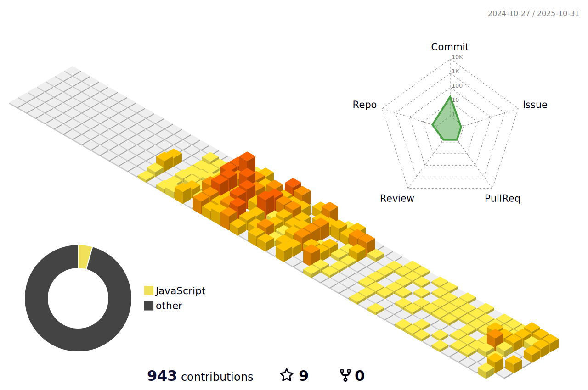

## Hi there 👋
I'm a  **Senior Magento 2 / Adobe Commerce Developer | Back-End Focused with Strong Front-End Understanding |** with over **7+ years** of commercial experience, **having worked on 15+ projects**, in developing and optimizing eCommerce solutions for both B2B and B2C businesses.

Throughout my career, I’ve created numerous custom modules, API integrations, and performance optimizations that improved checkout experience, user engagement, and scalability.

Although my core expertise lies in **back-end (PHP)**, I’m also **experienced with Magento 2 / Adobe Commerce Front-End (JavaScript, Magento 2 / Adobe Commerce UI Components, and Magento 2 / Adobe Commerce JS Components)**, enabling me to work effectively across both back-end and front-end layers.

I’m passionate about clean architecture, maintainable code, and continuous self-development. I value clear communication, teamwork, and technical excellence.

💡 **Open to opportunities** as a **Magento 2 / Adobe Commerce Developer (Back-End, Full-Stack, or Solution Engineer roles) / PHP Developer**

## 🔧 Technologies & Tools
**Platform:**

 
 

**Languages:**

**Libs:**

**Tools and Services:**

## 🗂️ Highlights & Some Stats:
<!--  
 -->

##  :page_facing_up:/:envelope: CV and Connect:

   
  

  

<!-- 
 
 -->
